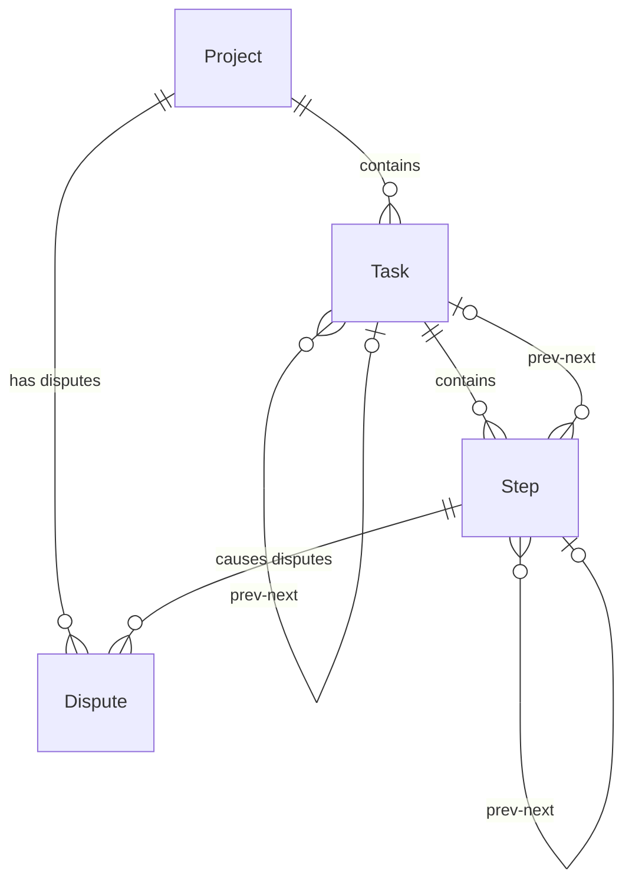
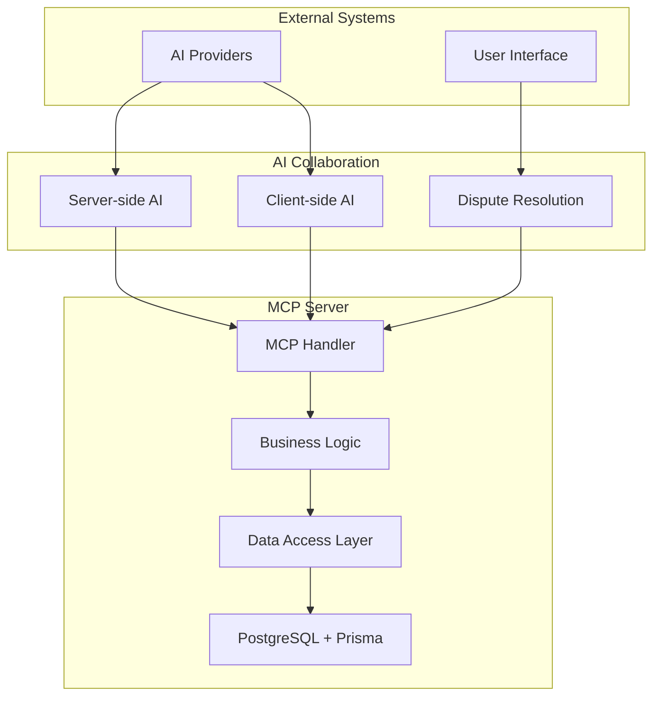

# System Architecture

## Overview

MCP-Planner implements a hierarchical task management system designed for AI-driven project planning and execution. The architecture supports collaborative content creation between multiple AI agents with human oversight.

## Core Entities

### Entity Hierarchy

```
Project (Root)
├── Task (Project-level)
│   ├── Step
│   ├── Step
│   └── Sub-task
│       ├── Step
│       └── Step
└── Task (Project-level)
    ├── Step
    └── Step
```

### Entity Relationships



## Key Design Principles

### 1. Hierarchical Progress Calculation
Progress flows upward from children to parents:
- **Step Progress**: Binary (0.0 or 1.0) - pending or completed
- **Task Progress**: Average of all child steps and sub-tasks
- **Project Progress**: Average of all root-level tasks

```go
func CalculateTaskProgress(taskID string) float64 {
    steps := getTaskSteps(taskID)
    subTasks := getSubTasks(taskID)

    totalItems := len(steps) + len(subTasks)
    if totalItems == 0 {
        return 0.0
    }

    completedProgress := 0.0

    // Sum step progress (0.0 or 1.0)
    for _, step := range steps {
        completedProgress += step.Progress
    }

    // Sum sub-task progress (recursive)
    for _, subTask := range subTasks {
        completedProgress += CalculateTaskProgress(subTask.ID)
    }

    return completedProgress / float64(totalItems)
}
```

### 2. Polymorphic Navigation
Steps and Tasks can reference each other using namespaced IDs:

```go
// Namespaced ID format: "type://uuid"
type ItemReference struct {
    Type string // "task" or "step"
    ID   string // UUID
}

// Examples:
// step.NextID = "task://123e4567-e89b-12d3-a456-426614174000"
// task.PrevID = "step://987fcdeb-51a2-43d1-9f4e-123456789abc"
```

### 3. Sequential Execution Model
No steps are skipped - every item must be executed in sequence:

```go
func GetNextActionableItem(projectID string) (*WorkItem, error) {
    // Find the first incomplete item in the project workflow
    rootTasks := getRootTasks(projectID)

    for _, task := range rootTasks {
        if task.Progress < 1.0 {
            // If task has steps, find first incomplete step
            if hasSteps(task.ID) {
                return getFirstIncompleteStep(task.ID)
            }
            // Otherwise, the task itself is the next item
            return &WorkItem{Type: "task", ID: task.ID}, nil
        }
    }

    return nil, errors.New("no actionable items found")
}
```

## Technical Architecture

### Technology Stack
- **Backend**: Go 1.21+
- **Database**: PostgreSQL 15+
- **ORM**: Prisma Go Client
- **Protocol**: Model Context Protocol (MCP)
- **AI Integration**: Pluggable AI providers

### System Components



### Data Flow

1. **Project Creation**: Client AI creates project with description and root task objectives
2. **Content Creation**: Server AI crafts detailed step content with project context
3. **Content Review**: Client AI reviews and refines content with full project awareness
4. **Iteration**: AIs collaborate within configurable iteration limits
5. **Dispute Resolution**: Human intervention when AIs disagree
6. **Execution**: Sequential processing of agreed-upon steps and tasks

## Scalability Considerations

### Database Design
- **UUID Primary Keys**: Distributed-friendly identifiers
- **Indexed Navigation**: Efficient prev/next traversal
- **Hierarchical Queries**: Optimized for tree operations

### Performance Optimizations
- **Lazy Loading**: Load child entities on demand
- **Progress Caching**: Cache calculated progress values
- **Batch Operations**: Bulk updates for large projects

### Concurrency Handling
- **Optimistic Locking**: Handle concurrent AI updates
- **Transaction Boundaries**: Ensure data consistency
- **Event-driven Updates**: Real-time progress notifications

## Security & Access Control

### Authentication
- MCP server authentication via standard MCP mechanisms
- AI provider API key management
- User session management for dispute resolution

### Authorization
- Project-level access control
- Role-based permissions (creator, collaborator, viewer)
- AI agent scope limitations

### Data Protection
- Encrypted sensitive data (API keys, user content)
- Audit logging for all operations
- GDPR compliance for user data

## Error Handling & Resilience

### AI Provider Failures
```go
type AIProviderConfig struct {
    Primary   AIProvider
    Fallback  AIProvider
    Timeout   time.Duration
    Retries   int
}

func (c *AIProviderConfig) AnalyzeComplexity(content string) (*ComplexityResult, error) {
    result, err := c.Primary.Analyze(content)
    if err != nil && c.Fallback != nil {
        log.Warn("Primary AI provider failed, using fallback")
        return c.Fallback.Analyze(content)
    }
    return result, err
}
```

### Database Failures
- Connection pooling and retry logic
- Graceful degradation for read-only operations
- Data backup and recovery procedures

### Validation & Constraints
- Schema validation for all inputs
- Business rule enforcement
- Circular reference prevention in task hierarchies

---

*Next: [Dual-AI Collaboration](./02-dual-ai-collaboration.md)*
