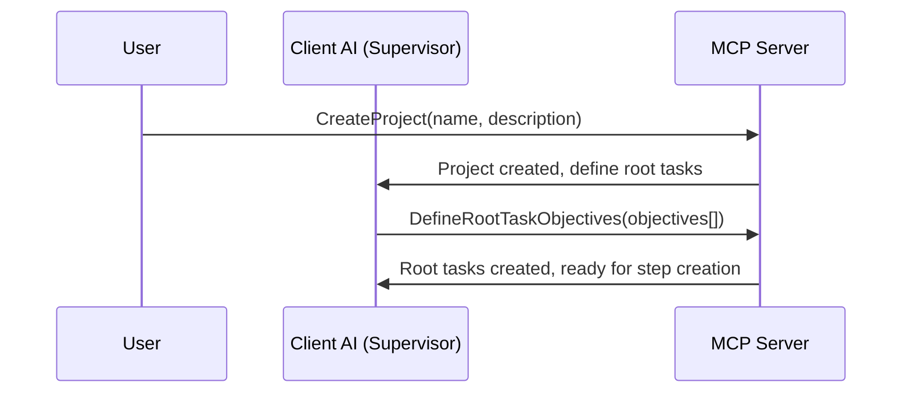
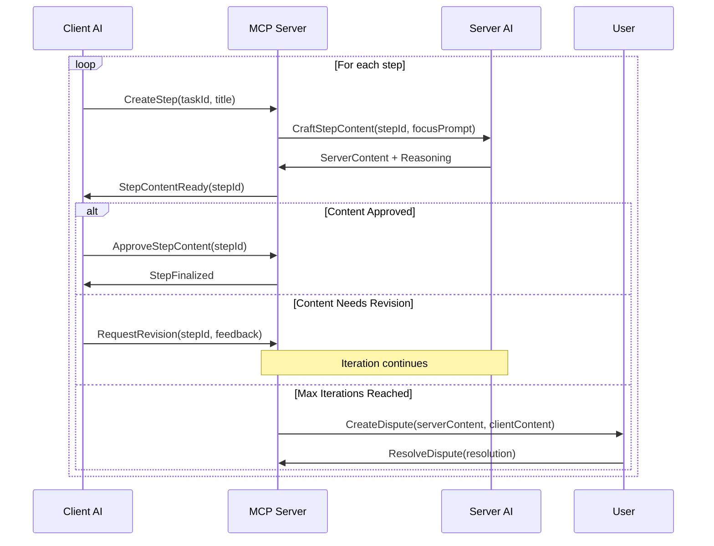

# Dual-AI Collaboration

## Overview

The MCP-Planner system implements a sophisticated dual-AI collaboration model where two AI agents work together to create and refine task content. This approach ensures high-quality, contextually appropriate task planning through iterative refinement and collaborative decision-making.

## AI Agent Roles

### Server-Side AI: The Content Creator
**Responsibilities:**
- Craft detailed implementation content for individual steps
- Analyze step complexity with project context
- Focus on technical implementation details
- Provide reasoning for content decisions

**Context Access:**
- Full project description and objectives
- Current task context and objectives
- Target step title and position
- Previous steps in the current task
- Guided focus prompts for step-specific work

**Limitations:**
- Should focus on the specific step being processed
- Does not maintain state between different steps
- Guided by focus prompts to avoid scope creep

### Client-Side AI: The Supervisor
**Responsibilities:**
- Review and refine server-generated content
- Maintain overall project coherence
- Assess content quality and completeness
- Make final decisions on content approval
- Define root task objectives from project description

**Context Access:**
- Complete project description and vision
- All previously completed steps and tasks
- Full project tree structure and progress
- Cross-task dependencies and relationships
- Historical decisions and rationale

**Authority:**
- Final approval authority on step content
- Can request content revisions
- Determines when content is ready for finalization

## Collaboration Workflow

### Phase 1: Project Initialization



**Example:**
```go
// User creates project
project := CreateProject(
    "E-commerce Platform",
    "Build a modern e-commerce platform with user authentication, product catalog, shopping cart, payment processing, and order management. Must be scalable, secure, and mobile-responsive."
)

// Client AI analyzes description and creates root tasks
rootTasks := DefineRootTaskObjectives(project.ID, []TaskObjective{
    {
        Title: "User Authentication System",
        Objective: "Implement secure user registration, login, and profile management"
    },
    {
        Title: "Product Catalog Management",
        Objective: "Create product listing, search, filtering, and categorization features"
    },
    {
        Title: "Shopping Cart & Checkout",
        Objective: "Build cart functionality and secure checkout process"
    }
})
```

### Phase 2: Iterative Step Refinement



### Phase 3: Content Creation Process

#### Server AI Content Generation
```go
func CraftStepContentWithContext(stepId string, focusPrompt string) (*ContentResult, error) {
    step := getStep(stepId)
    task := getTask(step.TaskID)
    project := getProject(task.ProjectID)
    previousSteps := getPreviousSteps(stepId)

    prompt := buildServerPrompt(ServerPromptContext{
        ProjectDescription: project.Description,
        TaskObjective:     task.Objective,
        StepTitle:        step.Title,
        PreviousSteps:    previousSteps,
        FocusGuidance:    focusPrompt,
    })

    content, reasoning := callAIProvider(prompt)

    return &ContentResult{
        Content:   content,
        Reasoning: reasoning,
        Complexity: analyzeComplexity(content),
    }, nil
}
```

#### Client AI Review Process
```go
func ReviewStepContent(stepId string) (*ReviewResult, error) {
    step := getStep(stepId)
    projectContext := getFullProjectContext(step.TaskID)

    prompt := buildClientPrompt(ClientPromptContext{
        ProjectVision:    projectContext.Description,
        AllTasks:        projectContext.Tasks,
        CurrentStep:     step,
        ServerContent:   step.ServerContent,
        ServerReasoning: step.ServerReasoning,
    })

    review := callAIProvider(prompt)

    return &ReviewResult{
        Approved:        review.Approved,
        RefinedContent: review.RefinedContent,
        Feedback:       review.Feedback,
        Reasoning:      review.Reasoning,
    }, nil
}
```

## Iteration Control

### Configurable Limits
```go
type IterationConfig struct {
    MaxIterations    int     `default:"3"`
    TimeoutMinutes   int     `default:"30"`
    AutoEscalate     bool    `default:"true"`
}

type IterationState struct {
    StepID          string
    CurrentIteration int
    MaxIterations   int
    History         []IterationRecord
    Status          IterationStatus
}

type IterationRecord struct {
    Iteration       int
    ServerContent   string
    ClientFeedback  string
    Timestamp       time.Time
    Action          string // "created", "revised", "approved", "disputed"
}
```

### Iteration Flow Control
```go
func ProcessStepIteration(stepId string) (*IterationResult, error) {
    state := getIterationState(stepId)
    config := getProjectIterationConfig(state.ProjectID)

    if state.CurrentIteration >= config.MaxIterations {
        return createDispute(stepId, state)
    }

    // Server AI creates/revises content
    serverResult := craftStepContent(stepId)
    state.recordIteration("server_content", serverResult)

    // Client AI reviews
    clientResult := reviewStepContent(stepId)
    state.recordIteration("client_review", clientResult)

    if clientResult.Approved {
        return finalizeStep(stepId, clientResult.FinalContent)
    }

    state.CurrentIteration++
    return continueIteration(stepId, clientResult.Feedback)
}
```

## Complexity Assessment Collaboration

### Dual Complexity Analysis
Both AIs independently assess step complexity and collaborate on promotion decisions:

```go
type ComplexityAssessment struct {
    Score       float64  // 0.0 to 1.0
    Level       string   // "low", "medium", "high"
    Reasoning   string   // Why this complexity level
    ShouldPromote bool   // Recommend promotion to task
    SuggestedSubtasks []string // If promoting, suggested breakdown
}

func CollaborativeComplexityAnalysis(stepId string) (*ComplexityDecision, error) {
    // Server AI analyzes complexity
    serverAssessment := serverAI.AnalyzeComplexity(stepId)

    // Client AI analyzes complexity with full context
    clientAssessment := clientAI.AnalyzeComplexity(stepId)

    // Determine agreement
    if complexityAgreement(serverAssessment, clientAssessment) {
        return &ComplexityDecision{
            Agreed:     true,
            Complexity: serverAssessment.Level,
            ShouldPromote: serverAssessment.ShouldPromote && clientAssessment.ShouldPromote,
        }, nil
    }

    // Disagreement - escalate or use weighted decision
    return resolveComplexityDisagreement(serverAssessment, clientAssessment)
}
```

## Dispute Resolution

### Dispute Creation
When AIs cannot reach agreement within iteration limits:

```go
type Dispute struct {
    ID              string
    StepID          string
    ProjectID       string
    ServerContent   string
    ClientContent   string
    ServerReasoning string
    ClientReasoning string
    IterationHistory []IterationRecord
    Status          DisputeStatus
    CreatedAt       time.Time
}

func CreateDispute(stepId string, iterationState *IterationState) (*Dispute, error) {
    step := getStep(stepId)

    dispute := &Dispute{
        ID:              generateUUID(),
        StepID:          stepId,
        ProjectID:       step.Task.ProjectID,
        ServerContent:   iterationState.LastServerContent(),
        ClientContent:   iterationState.LastClientContent(),
        ServerReasoning: iterationState.LastServerReasoning(),
        ClientReasoning: iterationState.LastClientReasoning(),
        IterationHistory: iterationState.History,
        Status:          "pending",
        CreatedAt:       time.Now(),
    }

    return saveDispute(dispute)
}
```

### Human Resolution Interface
```go
type DisputePresentation struct {
    Dispute         *Dispute
    StepContext     *StepContext
    ProjectContext  *ProjectContext
    ResolutionOptions []ResolutionOption
}

type ResolutionOption struct {
    Type        string // "server", "client", "custom", "hybrid"
    Description string
    Preview     string
}

func PresentDisputeForResolution(disputeId string) (*DisputePresentation, error) {
    dispute := getDispute(disputeId)
    step := getStep(dispute.StepID)

    return &DisputePresentation{
        Dispute:     dispute,
        StepContext: buildStepContext(step),
        ProjectContext: buildProjectContext(dispute.ProjectID),
        ResolutionOptions: []ResolutionOption{
            {
                Type: "server",
                Description: "Use Server AI's version",
                Preview: dispute.ServerContent,
            },
            {
                Type: "client",
                Description: "Use Client AI's version",
                Preview: dispute.ClientContent,
            },
            {
                Type: "custom",
                Description: "Provide custom content",
                Preview: "",
            },
            {
                Type: "hybrid",
                Description: "Combine both versions",
                Preview: generateHybridPreview(dispute),
            },
        },
    }, nil
}
```

## AI Prompt Templates

### Server AI Prompt Template
```go
const ServerPromptTemplate = `
PROJECT CONTEXT:
Project: {{.ProjectName}}
Description: {{.ProjectDescription}}

CURRENT TASK:
Task: {{.TaskTitle}}
Objective: {{.TaskObjective}}

STEP TO IMPLEMENT:
Title: {{.StepTitle}}
Position: Step {{.StepNumber}} of {{.TotalSteps}}

PREVIOUS STEPS COMPLETED:
{{range .PreviousSteps}}
- {{.Title}}: {{.Summary}}
{{end}}

FOCUS GUIDANCE:
{{.FocusPrompt}}

INSTRUCTIONS:
Create detailed, actionable content for this specific step. Include:
1. Clear implementation instructions
2. Code examples where applicable
3. Configuration details
4. Testing considerations
5. Dependencies and prerequisites

Stay focused on this step only. Provide markdown-formatted content.
`
```

### Client AI Prompt Template
```go
const ClientPromptTemplate = `
PROJECT VISION:
{{.ProjectDescription}}

FULL PROJECT CONTEXT:
{{range .AllTasks}}
Task: {{.Title}}
Objective: {{.Objective}}
Progress: {{.Progress}}%
{{end}}

CURRENT STEP REVIEW:
Step: {{.StepTitle}}
Task: {{.TaskTitle}}

SERVER AI CONTENT:
{{.ServerContent}}

SERVER AI REASONING:
{{.ServerReasoning}}

REVIEW CRITERIA:
1. Does the content align with the overall project vision?
2. Is it consistent with previous steps and tasks?
3. Are there any missing dependencies or considerations?
4. Is the complexity appropriate for a single step?
5. Does it maintain quality and clarity standards?

INSTRUCTIONS:
Review the server AI's content and either:
- APPROVE: If content is good as-is
- REFINE: Provide improved version with explanation
- REJECT: Request revision with specific feedback

Provide your assessment and any refinements in markdown format.
`
```

## Success Metrics

### Collaboration Efficiency
- **Agreement Rate**: Percentage of steps agreed upon without disputes
- **Iteration Average**: Mean iterations per step before agreement
- **Time to Agreement**: Average time from step creation to finalization

### Content Quality
- **User Satisfaction**: Rating of final step content quality
- **Execution Success**: Percentage of steps successfully completed as written
- **Revision Frequency**: How often finalized content needs updates

### System Performance
- **Dispute Resolution Time**: Average time to resolve user disputes
- **AI Response Time**: Latency for AI content generation and review
- **Throughput**: Steps processed per hour/day

---

*Next: [Data Schema](./03-data-schema.md)*
