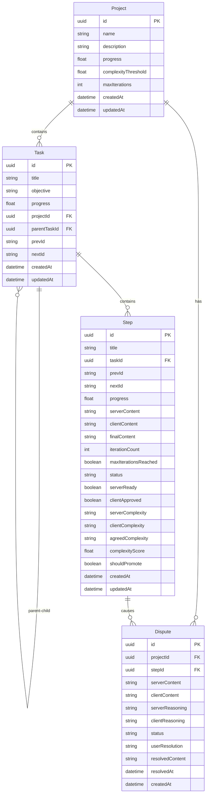

# Data Schema

## Overview

The MCP-Planner system uses PostgreSQL with Prisma ORM to manage a hierarchical task structure with polymorphic relationships and dual-AI collaboration metadata. The schema is designed for performance, scalability, and data integrity.

## Complete Prisma Schema

```prisma
// schema.prisma
generator client {
  provider = "prisma-client-go"
}

datasource db {
  provider = "postgresql"
  url      = env("DATABASE_URL")
}

model Project {
  id                    String    @id @default(uuid())
  name                  String
  description           String    // MANDATORY - project vision and requirements
  progress              Float     @default(0)
  complexityThreshold   Float     @default(0.7)
  maxIterations         Int       @default(3)
  createdAt            DateTime  @default(now())
  updatedAt            DateTime  @updatedAt

  // Relationships
  tasks                Task[]
  disputes             Dispute[]

  @@map("projects")
}

model Task {
  id           String    @id @default(uuid())
  title        String
  objective    String    // What this task should accomplish
  progress     Float     @default(0)
  projectId    String
  parentTaskId String?   // null = root task, not-null = sub-task
  prevId       String?   // Polymorphic: "task://uuid" or "step://uuid"
  nextId       String?   // Polymorphic: "task://uuid" or "step://uuid"
  createdAt    DateTime  @default(now())
  updatedAt    DateTime  @updatedAt

  // Relationships
  project      Project   @relation(fields: [projectId], references: [id], onDelete: Cascade)
  parentTask   Task?     @relation("TaskHierarchy", fields: [parentTaskId], references: [id])
  subTasks     Task[]    @relation("TaskHierarchy")
  steps        Step[]

  // Indexes
  @@index([projectId])
  @@index([parentTaskId])
  @@index([prevId])
  @@index([nextId])
  @@map("tasks")
}

model Step {
  id               String    @id @default(uuid())
  title            String
  taskId           String
  prevId           String?   // Polymorphic: "task://uuid" or "step://uuid"
  nextId           String?   // Polymorphic: "task://uuid" or "step://uuid"
  progress         Float     @default(0)

  // Dual-AI collaboration content
  serverContent    String?   // Server AI generated content (markdown)
  clientContent    String?   // Client AI refined content (markdown)
  finalContent     String?   // Final agreed/resolved content (markdown)

  // Iteration tracking
  iterationCount   Int       @default(0)
  maxIterationsReached Boolean @default(false)

  // Collaboration state
  status           String    @default("pending") // pending, server_draft, client_review, agreed, disputed, user_resolution
  serverReady      Boolean   @default(false)
  clientApproved   Boolean   @default(false)

  // Complexity assessment
  serverComplexity String?   // low, medium, high
  clientComplexity String?   // low, medium, high
  agreedComplexity String?   // Final agreed complexity
  complexityScore  Float?    // 0.0 to 1.0
  shouldPromote    Boolean?  // Should be promoted to task

  // Metadata
  createdAt        DateTime  @default(now())
  updatedAt        DateTime  @updatedAt

  // Relationships
  task             Task      @relation(fields: [taskId], references: [id], onDelete: Cascade)
  disputes         Dispute[]

  // Indexes
  @@index([taskId])
  @@index([status])
  @@index([prevId])
  @@index([nextId])
  @@index([complexityScore])
  @@map("steps")
}

model Dispute {
  id              String    @id @default(uuid())
  projectId       String
  stepId          String
  serverContent   String    // Server AI's final version
  clientContent   String    // Client AI's final version
  serverReasoning String    // Server AI's reasoning
  clientReasoning String    // Client AI's reasoning
  status          String    @default("pending") // pending, resolved
  userResolution  String?   // server, client, custom, hybrid
  resolvedContent String?   // Final user-resolved content
  resolvedAt      DateTime?
  createdAt       DateTime  @default(now())

  // Relationships
  project         Project   @relation(fields: [projectId], references: [id], onDelete: Cascade)
  step            Step      @relation(fields: [stepId], references: [id], onDelete: Cascade)

  // Indexes
  @@index([projectId])
  @@index([stepId])
  @@index([status])
  @@map("disputes")
}

// Audit log for tracking all changes
model AuditLog {
  id          String    @id @default(uuid())
  entityType  String    // project, task, step, dispute
  entityId    String
  action      String    // created, updated, deleted, promoted, disputed, resolved
  oldValues   Json?     // Previous state
  newValues   Json?     // New state
  userId      String?   // User who made the change (if applicable)
  aiAgent     String?   // server_ai, client_ai
  timestamp   DateTime  @default(now())

  @@index([entityType, entityId])
  @@index([timestamp])
  @@map("audit_logs")
}
```

## Entity Relationships

### Hierarchical Structure


## Polymorphic Navigation

### Namespaced ID Format
```go
// Polymorphic reference format: "type://uuid"
type ItemReference struct {
    Type string // "task" or "step"
    ID   string // UUID
}

func (ir *ItemReference) String() string {
    return fmt.Sprintf("%s://%s", ir.Type, ir.ID)
}

func ParseReference(ref string) (*ItemReference, error) {
    if ref == "" {
        return nil, nil
    }

    parts := strings.Split(ref, "://")
    if len(parts) != 2 {
        return nil, fmt.Errorf("invalid reference format: %s", ref)
    }

    if parts[0] != "task" && parts[0] != "step" {
        return nil, fmt.Errorf("invalid reference type: %s", parts[0])
    }

    return &ItemReference{
        Type: parts[0],
        ID:   parts[1],
    }, nil
}
```

### Navigation Examples
```sql
-- Find next item for a step
SELECT
    CASE
        WHEN next_id LIKE 'task://%' THEN 'task'
        WHEN next_id LIKE 'step://%' THEN 'step'
    END as next_type,
    SUBSTRING(next_id FROM 8) as next_uuid
FROM steps
WHERE id = $1;

-- Get all items in a navigation chain
WITH RECURSIVE navigation_chain AS (
    -- Base case: start with first item
    SELECT id, 'step' as type, title, next_id, 0 as depth
    FROM steps
    WHERE prev_id IS NULL AND task_id = $1

    UNION ALL

    -- Recursive case: follow next_id references
    SELECT
        CASE
            WHEN nc.next_id LIKE 'task://%' THEN t.id
            WHEN nc.next_id LIKE 'step://%' THEN s.id
        END as id,
        CASE
            WHEN nc.next_id LIKE 'task://%' THEN 'task'
            WHEN nc.next_id LIKE 'step://%' THEN 'step'
        END as type,
        CASE
            WHEN nc.next_id LIKE 'task://%' THEN t.title
            WHEN nc.next_id LIKE 'step://%' THEN s.title
        END as title,
        CASE
            WHEN nc.next_id LIKE 'task://%' THEN t.next_id
            WHEN nc.next_id LIKE 'step://%' THEN s.next_id
        END as next_id,
        nc.depth + 1
    FROM navigation_chain nc
    LEFT JOIN tasks t ON nc.next_id = 'task://' || t.id
    LEFT JOIN steps s ON nc.next_id = 'step://' || s.id
    WHERE nc.next_id IS NOT NULL AND nc.depth < 100
)
SELECT * FROM navigation_chain ORDER BY depth;
```

## Data Validation & Constraints

### Database Constraints
```sql
-- Ensure progress is between 0 and 1
ALTER TABLE projects ADD CONSTRAINT check_project_progress
    CHECK (progress >= 0 AND progress <= 1);

ALTER TABLE tasks ADD CONSTRAINT check_task_progress
    CHECK (progress >= 0 AND progress <= 1);

ALTER TABLE steps ADD CONSTRAINT check_step_progress
    CHECK (progress >= 0 AND progress <= 1);

-- Ensure complexity threshold is valid
ALTER TABLE projects ADD CONSTRAINT check_complexity_threshold
    CHECK (complexity_threshold >= 0 AND complexity_threshold <= 1);

-- Ensure max iterations is positive
ALTER TABLE projects ADD CONSTRAINT check_max_iterations
    CHECK (max_iterations > 0);

-- Ensure iteration count doesn't exceed max
ALTER TABLE steps ADD CONSTRAINT check_iteration_count
    CHECK (iteration_count >= 0);

-- Validate polymorphic references
ALTER TABLE tasks ADD CONSTRAINT check_prev_id_format
    CHECK (prev_id IS NULL OR prev_id ~ '^(task|step)://[0-9a-f-]{36}$');

ALTER TABLE tasks ADD CONSTRAINT check_next_id_format
    CHECK (next_id IS NULL OR next_id ~ '^(task|step)://[0-9a-f-]{36}$');

ALTER TABLE steps ADD CONSTRAINT check_prev_id_format
    CHECK (prev_id IS NULL OR prev_id ~ '^(task|step)://[0-9a-f-]{36}$');

ALTER TABLE steps ADD CONSTRAINT check_next_id_format
    CHECK (next_id IS NULL OR next_id ~ '^(task|step)://[0-9a-f-]{36}$');

-- Validate status values
ALTER TABLE steps ADD CONSTRAINT check_status_values
    CHECK (status IN ('pending', 'server_draft', 'client_review', 'agreed', 'disputed', 'user_resolution'));

ALTER TABLE disputes ADD CONSTRAINT check_dispute_status
    CHECK (status IN ('pending', 'resolved'));

ALTER TABLE disputes ADD CONSTRAINT check_resolution_type
    CHECK (user_resolution IS NULL OR user_resolution IN ('server', 'client', 'custom', 'hybrid'));

-- Validate complexity values
ALTER TABLE steps ADD CONSTRAINT check_server_complexity
    CHECK (server_complexity IS NULL OR server_complexity IN ('low', 'medium', 'high'));

ALTER TABLE steps ADD CONSTRAINT check_client_complexity
    CHECK (client_complexity IS NULL OR client_complexity IN ('low', 'medium', 'high'));

ALTER TABLE steps ADD CONSTRAINT check_agreed_complexity
    CHECK (agreed_complexity IS NULL OR agreed_complexity IN ('low', 'medium', 'high'));

-- Ensure complexity score is valid
ALTER TABLE steps ADD CONSTRAINT check_complexity_score
    CHECK (complexity_score IS NULL OR (complexity_score >= 0 AND complexity_score <= 1));
```

### Application-Level Validation
```go
type ValidationError struct {
    Field   string
    Message string
}

func ValidateProject(project *Project) []ValidationError {
    var errors []ValidationError

    if strings.TrimSpace(project.Name) == "" {
        errors = append(errors, ValidationError{
            Field: "name",
            Message: "Project name is required",
        })
    }

    if strings.TrimSpace(project.Description) == "" {
        errors = append(errors, ValidationError{
            Field: "description",
            Message: "Project description is mandatory",
        })
    }

    if project.ComplexityThreshold < 0 || project.ComplexityThreshold > 1 {
        errors = append(errors, ValidationError{
            Field: "complexityThreshold",
            Message: "Complexity threshold must be between 0 and 1",
        })
    }

    if project.MaxIterations <= 0 {
        errors = append(errors, ValidationError{
            Field: "maxIterations",
            Message: "Max iterations must be positive",
        })
    }

    return errors
}

func ValidatePolymorphicReference(ref string) error {
    if ref == "" {
        return nil // null references are allowed
    }

    parts := strings.Split(ref, "://")
    if len(parts) != 2 {
        return fmt.Errorf("invalid reference format, expected 'type://uuid'")
    }

    if parts[0] != "task" && parts[0] != "step" {
        return fmt.Errorf("invalid reference type, must be 'task' or 'step'")
    }

    if !isValidUUID(parts[1]) {
        return fmt.Errorf("invalid UUID format")
    }

    return nil
}
```

## Performance Optimization

### Indexes
```sql
-- Primary navigation indexes
CREATE INDEX idx_tasks_project_id ON tasks(project_id);
CREATE INDEX idx_tasks_parent_task_id ON tasks(parent_task_id);
CREATE INDEX idx_steps_task_id ON steps(task_id);

-- Navigation chain indexes
CREATE INDEX idx_tasks_prev_id ON tasks(prev_id);
CREATE INDEX idx_tasks_next_id ON tasks(next_id);
CREATE INDEX idx_steps_prev_id ON steps(prev_id);
CREATE INDEX idx_steps_next_id ON steps(next_id);

-- Status and workflow indexes
CREATE INDEX idx_steps_status ON steps(status);
CREATE INDEX idx_steps_server_ready ON steps(server_ready);
CREATE INDEX idx_steps_client_approved ON steps(client_approved);

-- Complexity analysis indexes
CREATE INDEX idx_steps_complexity_score ON steps(complexity_score);
CREATE INDEX idx_steps_should_promote ON steps(should_promote);

-- Dispute resolution indexes
CREATE INDEX idx_disputes_project_id ON disputes(project_id);
CREATE INDEX idx_disputes_status ON disputes(status);

-- Audit and monitoring indexes
CREATE INDEX idx_audit_logs_entity ON audit_logs(entity_type, entity_id);
CREATE INDEX idx_audit_logs_timestamp ON audit_logs(timestamp);
```

### Query Optimization
```go
// Efficient progress calculation with single query
func CalculateProjectProgress(projectID string) (float64, error) {
    query := `
        WITH RECURSIVE task_tree AS (
            -- Root tasks
            SELECT id, progress, 0 as level
            FROM tasks
            WHERE project_id = $1 AND parent_task_id IS NULL

            UNION ALL

            -- Sub-tasks
            SELECT t.id, t.progress, tt.level + 1
            FROM tasks t
            JOIN task_tree tt ON t.parent_task_id = tt.id
        ),
        task_progress AS (
            SELECT
                t.id,
                t.progress as task_progress,
                COALESCE(AVG(s.progress), 0) as steps_progress,
                COUNT(s.id) as step_count
            FROM task_tree t
            LEFT JOIN steps s ON s.task_id = t.id
            GROUP BY t.id, t.progress
        )
        SELECT AVG(
            CASE
                WHEN step_count > 0 THEN steps_progress
                ELSE task_progress
            END
        ) as project_progress
        FROM task_progress tp
        JOIN task_tree tt ON tp.id = tt.id
        WHERE tt.level = 0;
    `

    var progress float64
    err := db.QueryRow(query, projectID).Scan(&progress)
    return progress, err
}
```

## Migration Strategy

### Initial Migration
```sql
-- V001_initial_schema.sql
CREATE EXTENSION IF NOT EXISTS "uuid-ossp";

-- Create tables in dependency order
CREATE TABLE projects (...);
CREATE TABLE tasks (...);
CREATE TABLE steps (...);
CREATE TABLE disputes (...);
CREATE TABLE audit_logs (...);

-- Add constraints
ALTER TABLE tasks ADD CONSTRAINT fk_tasks_project ...;
-- ... other constraints

-- Create indexes
CREATE INDEX idx_tasks_project_id ...;
-- ... other indexes
```

### Data Migration Utilities
```go
func MigrateFromLegacySystem(legacyDB *sql.DB, newDB *PrismaClient) error {
    // Migration logic for existing task management systems
    // Handle data transformation and validation
    return nil
}

func BackupDatabase(db *PrismaClient) error {
    // Create full database backup before major migrations
    return nil
}
```

---

*Next: [MCP Functions](./04-mcp-functions.md)*
