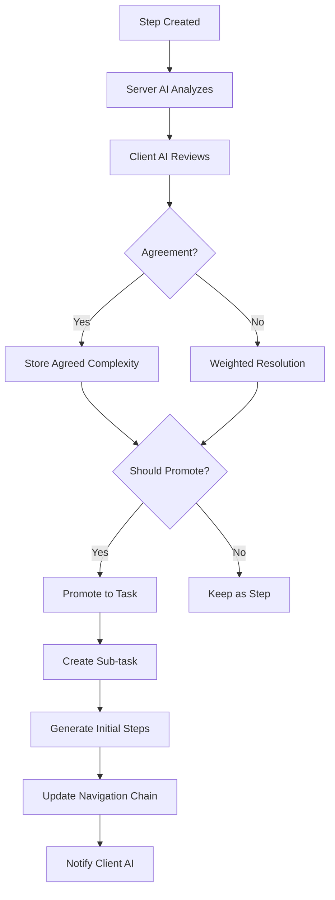

# Complexity Management

## Overview

The MCP-Planner system implements intelligent complexity management to automatically identify when steps become too complex and should be promoted to tasks. This ensures optimal task granularity and maintains manageable step sizes for effective execution.

## Complexity Analysis Framework

### Complexity Dimensions

The system evaluates step complexity across multiple dimensions:

1. **Content Length**: Amount of text in step description
2. **Structural Complexity**: Number of sub-components, lists, code blocks
3. **Cognitive Load**: Mental effort required to understand and execute
4. **Dependencies**: External resources, prerequisites, integrations
5. **Implementation Scope**: Breadth of changes or configurations required

### Complexity Scoring

```go
type ComplexityMetrics struct {
    ContentLength     int     `json:"content_length"`
    CodeBlocks        int     `json:"code_blocks"`
    ListItems         int     `json:"list_items"`
    ExternalLinks     int     `json:"external_links"`
    SubtaskKeywords   int     `json:"subtask_keywords"`
    TechnicalTerms    int     `json:"technical_terms"`
    ConfigurationSteps int    `json:"configuration_steps"`
}

type ComplexityScore struct {
    Overall          float64 `json:"overall"`          // 0.0 to 1.0
    ContentScore     float64 `json:"content_score"`
    StructuralScore  float64 `json:"structural_score"`
    CognitiveScore   float64 `json:"cognitive_score"`
    DependencyScore  float64 `json:"dependency_score"`
    ScopeScore       float64 `json:"scope_score"`
}
```

## AI-Driven Complexity Analysis

### Dual-AI Assessment

Both Server AI and Client AI independently assess complexity to ensure accuracy:

```go
type AIComplexityAnalysis struct {
    Agent           string  `json:"agent"`           // "server" or "client"
    Complexity      string  `json:"complexity"`      // "low", "medium", "high"
    Score           float64 `json:"score"`           // 0.0 to 1.0
    Reasoning       string  `json:"reasoning"`       // AI explanation
    ShouldPromote   bool    `json:"should_promote"`  // Promotion recommendation
    SuggestedBreakdown []string `json:"suggested_breakdown"` // Proposed sub-tasks
    Confidence      float64 `json:"confidence"`      // 0.0 to 1.0
    AnalyzedAt      time.Time `json:"analyzed_at"`
}

func AnalyzeComplexityWithAI(stepId string, agent string) (*AIComplexityAnalysis, error) {
    step := getStep(stepId)
    project := getProject(step.Task.ProjectID)

    prompt := buildComplexityPrompt(ComplexityPromptContext{
        Agent:           agent,
        ProjectContext:  project.Description,
        TaskObjective:   step.Task.Objective,
        StepTitle:      step.Title,
        StepContent:    step.ServerContent, // or ClientContent for client AI
        PreviousSteps:  getPreviousSteps(stepId),
    })

    analysis := callAIProvider(prompt)

    return &AIComplexityAnalysis{
        Agent:           agent,
        Complexity:      analysis.Level,
        Score:           analysis.Score,
        Reasoning:       analysis.Reasoning,
        ShouldPromote:   analysis.ShouldPromote,
        SuggestedBreakdown: analysis.SubTasks,
        Confidence:      analysis.Confidence,
        AnalyzedAt:      time.Now(),
    }, nil
}
```

### Server AI Complexity Prompt

```go
const ServerComplexityPrompt = `
COMPLEXITY ANALYSIS REQUEST

PROJECT CONTEXT:
{{.ProjectContext}}

TASK OBJECTIVE:
{{.TaskObjective}}

STEP TO ANALYZE:
Title: {{.StepTitle}}
Content: {{.StepContent}}

PREVIOUS STEPS:
{{range .PreviousSteps}}
- {{.Title}}
{{end}}

ANALYSIS CRITERIA:
Evaluate this step's complexity considering:

1. IMPLEMENTATION SCOPE
   - How many distinct actions are required?
   - Are there multiple configuration phases?
   - Does it span multiple systems/components?

2. COGNITIVE LOAD
   - How much domain knowledge is required?
   - Are there complex decision points?
   - How many concepts must be understood simultaneously?

3. DEPENDENCIES
   - How many external resources are needed?
   - Are there prerequisite configurations?
   - Does it require coordination with other systems?

4. TESTING & VALIDATION
   - How complex is verification?
   - Are multiple test scenarios required?
   - Does it need integration testing?

COMPLEXITY LEVELS:
- LOW (0.0-0.3): Single, straightforward action with clear outcome
- MEDIUM (0.3-0.7): Multiple related actions or moderate complexity
- HIGH (0.7-1.0): Complex multi-phase work that should be broken down

RESPONSE FORMAT:
{
  "complexity": "low|medium|high",
  "score": 0.0-1.0,
  "reasoning": "Detailed explanation of complexity assessment",
  "shouldPromote": true/false,
  "suggestedBreakdown": ["subtask1", "subtask2", ...],
  "confidence": 0.0-1.0
}

Provide your analysis:
`
```

### Client AI Complexity Prompt

```go
const ClientComplexityPrompt = `
COMPLEXITY REVIEW REQUEST

PROJECT VISION:
{{.ProjectContext}}

FULL TASK CONTEXT:
{{range .AllTasks}}
- {{.Title}}: {{.Objective}}
{{end}}

STEP TO REVIEW:
Title: {{.StepTitle}}
Content: {{.StepContent}}
Server AI Assessment: {{.ServerAssessment}}

REVIEW PERSPECTIVE:
As the project supervisor with full context, assess whether the Server AI's complexity analysis is accurate.

CONSIDERATIONS:
1. PROJECT COHERENCE
   - Does this step fit well within the overall project flow?
   - Is it appropriately sized relative to other steps?

2. EXECUTION PRACTICALITY
   - Can this realistically be completed as a single step?
   - Are there hidden complexities the Server AI missed?

3. QUALITY STANDARDS
   - Does breaking this down improve quality?
   - Will promotion help with better testing/validation?

4. RESOURCE EFFICIENCY
   - Is the complexity justified for the outcome?
   - Would promotion create unnecessary overhead?

RESPONSE FORMAT:
{
  "complexity": "low|medium|high",
  "score": 0.0-1.0,
  "reasoning": "Assessment from project supervisor perspective",
  "shouldPromote": true/false,
  "agreesWithServer": true/false,
  "disagreementReason": "Why assessment differs from Server AI",
  "confidence": 0.0-1.0
}

Provide your review:
`
```

## Complexity Agreement & Disagreement

### Agreement Resolution

```go
type ComplexityAgreement struct {
    Agreed          bool    `json:"agreed"`
    FinalComplexity string  `json:"final_complexity"`
    FinalScore      float64 `json:"final_score"`
    ShouldPromote   bool    `json:"should_promote"`
    Resolution      string  `json:"resolution"` // "consensus", "weighted", "escalated"
}

func ResolveComplexityAssessment(serverAnalysis, clientAnalysis *AIComplexityAnalysis) (*ComplexityAgreement, error) {
    // Check for direct agreement
    if serverAnalysis.Complexity == clientAnalysis.Complexity &&
       serverAnalysis.ShouldPromote == clientAnalysis.ShouldPromote {
        return &ComplexityAgreement{
            Agreed:          true,
            FinalComplexity: serverAnalysis.Complexity,
            FinalScore:      (serverAnalysis.Score + clientAnalysis.Score) / 2,
            ShouldPromote:   serverAnalysis.ShouldPromote,
            Resolution:      "consensus",
        }, nil
    }

    // Check for close agreement (within one level)
    if isCloseAgreement(serverAnalysis, clientAnalysis) {
        return resolveCloseAgreement(serverAnalysis, clientAnalysis)
    }

    // Significant disagreement - use weighted approach or escalate
    return resolveDisagreement(serverAnalysis, clientAnalysis)
}

func isCloseAgreement(server, client *AIComplexityAnalysis) bool {
    complexityOrder := map[string]int{"low": 1, "medium": 2, "high": 3}
    diff := abs(complexityOrder[server.Complexity] - complexityOrder[client.Complexity])
    return diff <= 1 && abs(server.Score - client.Score) <= 0.2
}
```

### Disagreement Handling

```go
func resolveDisagreement(server, client *AIComplexityAnalysis) (*ComplexityAgreement, error) {
    // Weight by confidence scores
    serverWeight := server.Confidence
    clientWeight := client.Confidence

    // Client AI has more project context, so slight bias
    clientWeight *= 1.1

    totalWeight := serverWeight + clientWeight
    weightedScore := (server.Score * serverWeight + client.Score * clientWeight) / totalWeight

    // Determine final complexity level
    finalComplexity := "medium" // default
    if weightedScore < 0.3 {
        finalComplexity = "low"
    } else if weightedScore > 0.7 {
        finalComplexity = "high"
    }

    // Conservative approach to promotion - both must agree or high confidence
    shouldPromote := (server.ShouldPromote && client.ShouldPromote) ||
                    (weightedScore > 0.8 && (server.Confidence > 0.8 || client.Confidence > 0.8))

    return &ComplexityAgreement{
        Agreed:          false,
        FinalComplexity: finalComplexity,
        FinalScore:      weightedScore,
        ShouldPromote:   shouldPromote,
        Resolution:      "weighted",
    }, nil
}
```

## Step Promotion Process

### Promotion Workflow



### Promotion Implementation

```go
type PromotionResult struct {
    OriginalStepID  string    `json:"original_step_id"`
    NewTaskID       string    `json:"new_task_id"`
    GeneratedSteps  []string  `json:"generated_steps"`
    PreservedContent string   `json:"preserved_content"`
    NavigationUpdated bool    `json:"navigation_updated"`
    Reason          string    `json:"reason"`
    PromotedAt      time.Time `json:"promoted_at"`
}

func PromoteStepToTask(stepId string, preserveContent bool) (*PromotionResult, error) {
    step := getStep(stepId)
    parentTask := getTask(step.TaskID)

    // Create new sub-task
    newTask := &Task{
        ID:           generateUUID(),
        Title:        step.Title,
        Objective:    extractObjectiveFromContent(step.FinalContent),
        ProjectID:    parentTask.ProjectID,
        ParentTaskID: &parentTask.ID,
        PrevID:       step.PrevID,
        NextID:       step.NextID,
        Progress:     0.0,
    }

    // Save new task
    savedTask := saveTask(newTask)

    // Generate initial steps for new task
    generatedSteps := generateInitialSteps(savedTask, step.FinalContent)

    // Update navigation chain
    updateNavigationChain(step, savedTask)

    // Remove original step
    deleteStep(stepId)

    return &PromotionResult{
        OriginalStepID:   stepId,
        NewTaskID:        savedTask.ID,
        GeneratedSteps:   getStepIDs(generatedSteps),
        PreservedContent: step.FinalContent,
        NavigationUpdated: true,
        Reason:           "Complexity threshold exceeded",
        PromotedAt:       time.Now(),
    }, nil
}
```

### Initial Step Generation

```go
func generateInitialSteps(task *Task, originalContent string) ([]*Step, error) {
    prompt := buildStepGenerationPrompt(StepGenerationContext{
        TaskTitle:       task.Title,
        TaskObjective:   task.Objective,
        OriginalContent: originalContent,
        ProjectContext:  getProject(task.ProjectID).Description,
    })

    aiResponse := callAIProvider(prompt)

    var steps []*Step
    for i, stepTitle := range aiResponse.StepTitles {
        step := &Step{
            ID:       generateUUID(),
            Title:    stepTitle,
            TaskID:   task.ID,
            Progress: 0.0,
            Status:   "pending",
        }

        // Set up navigation chain
        if i > 0 {
            step.PrevID = fmt.Sprintf("step://%s", steps[i-1].ID)
            steps[i-1].NextID = fmt.Sprintf("step://%s", step.ID)
        }

        steps = append(steps, step)
    }

    return saveSteps(steps), nil
}
```

## Project-Level Complexity Optimization

### Iterative Optimization

```go
type OptimizationConfig struct {
    ProjectID       string  `json:"project_id"`
    MaxIterations   int     `json:"max_iterations"`
    Threshold       float64 `json:"threshold"`
    ForceReanalysis bool    `json:"force_reanalysis"`
}

type OptimizationResult struct {
    ProjectID           string             `json:"project_id"`
    IterationsUsed      int               `json:"iterations_used"`
    PromotedSteps       []PromotionResult `json:"promoted_steps"`
    RemainingComplex    []string          `json:"remaining_complex"`
    ConvergenceReason   string            `json:"convergence_reason"`
    OptimizationComplete bool             `json:"optimization_complete"`
    TotalStepsAnalyzed  int               `json:"total_steps_analyzed"`
    TotalPromotions     int               `json:"total_promotions"`
}

func OptimizeProjectComplexity(config OptimizationConfig) (*OptimizationResult, error) {
    project := getProject(config.ProjectID)
    threshold := config.Threshold
    if threshold == 0 {
        threshold = project.ComplexityThreshold
    }

    result := &OptimizationResult{
        ProjectID: config.ProjectID,
    }

    for iteration := 0; iteration < config.MaxIterations; iteration++ {
        // Get all steps that need complexity analysis
        stepsToAnalyze := getStepsNeedingAnalysis(config.ProjectID, config.ForceReanalysis)

        if len(stepsToAnalyze) == 0 {
            result.ConvergenceReason = "no_steps_to_analyze"
            result.OptimizationComplete = true
            break
        }

        // Analyze complexity for all steps
        complexSteps := analyzeStepsComplexity(stepsToAnalyze, threshold)

        if len(complexSteps) == 0 {
            result.ConvergenceReason = "no_complex_steps"
            result.OptimizationComplete = true
            break
        }

        // Promote complex steps
        promotions := promoteComplexSteps(complexSteps)
        result.PromotedSteps = append(result.PromotedSteps, promotions...)

        // Check if any promotions occurred
        if len(promotions) == 0 {
            result.ConvergenceReason = "no_promotions"
            result.OptimizationComplete = true
            break
        }

        result.IterationsUsed = iteration + 1

        // Re-analyze newly created steps in next iteration
        config.ForceReanalysis = false // Only force on first iteration
    }

    if result.IterationsUsed >= config.MaxIterations {
        result.ConvergenceReason = "max_iterations"
        result.OptimizationComplete = false
    }

    // Get final statistics
    result.TotalStepsAnalyzed = countAnalyzedSteps(config.ProjectID)
    result.TotalPromotions = len(result.PromotedSteps)
    result.RemainingComplex = getRemainingComplexSteps(config.ProjectID, threshold)

    return result, nil
}
```

### Threshold-Based Re-evaluation

```go
func RetriggerComplexityOptimization(projectId string, newThreshold *float64) (*OptimizationResult, error) {
    project := getProject(projectId)

    // Update threshold if provided
    if newThreshold != nil {
        project.ComplexityThreshold = *newThreshold
        updateProject(project)
    }

    // Force re-analysis of all steps with new threshold
    config := OptimizationConfig{
        ProjectID:       projectId,
        MaxIterations:   10,
        Threshold:       project.ComplexityThreshold,
        ForceReanalysis: true,
    }

    return OptimizeProjectComplexity(config)
}
```

## Complexity Metrics & Analytics

### Project Complexity Dashboard

```go
type ComplexityMetrics struct {
    ProjectID           string                    `json:"project_id"`
    OverallComplexity   float64                  `json:"overall_complexity"`
    ComplexityDistribution map[string]int        `json:"complexity_distribution"`
    PromotionHistory    []PromotionEvent         `json:"promotion_history"`
    OptimizationRuns    []OptimizationSummary    `json:"optimization_runs"`
    ThresholdHistory    []ThresholdChange        `json:"threshold_history"`
    AIAgreementRate     float64                  `json:"ai_agreement_rate"`
    AverageComplexityScore float64               `json:"average_complexity_score"`
}

type PromotionEvent struct {
    StepID      string    `json:"step_id"`
    StepTitle   string    `json:"step_title"`
    NewTaskID   string    `json:"new_task_id"`
    Reason      string    `json:"reason"`
    Complexity  float64   `json:"complexity"`
    PromotedAt  time.Time `json:"promoted_at"`
}

func GetComplexityMetrics(projectId string) (*ComplexityMetrics, error) {
    steps := getAllSteps(projectId)
    promotions := getPromotionHistory(projectId)

    // Calculate distribution
    distribution := map[string]int{"low": 0, "medium": 0, "high": 0}
    totalScore := 0.0
    analyzedCount := 0
    agreementCount := 0

    for _, step := range steps {
        if step.AgreedComplexity != nil {
            distribution[*step.AgreedComplexity]++
            if step.ComplexityScore != nil {
                totalScore += *step.ComplexityScore
                analyzedCount++
            }

            // Check AI agreement
            if step.ServerComplexity != nil && step.ClientComplexity != nil &&
               *step.ServerComplexity == *step.ClientComplexity {
                agreementCount++
            }
        }
    }

    return &ComplexityMetrics{
        ProjectID:              projectId,
        OverallComplexity:      totalScore / float64(analyzedCount),
        ComplexityDistribution: distribution,
        PromotionHistory:       convertPromotions(promotions),
        AIAgreementRate:        float64(agreementCount) / float64(analyzedCount),
        AverageComplexityScore: totalScore / float64(analyzedCount),
    }, nil
}
```

## Best Practices & Guidelines

### Complexity Thresholds

**Recommended Thresholds by Project Type:**

- **Simple Projects** (0.8): Only promote very complex steps
- **Standard Projects** (0.7): Default balanced approach
- **Complex Projects** (0.6): More aggressive decomposition
- **Learning Projects** (0.5): Maximum granularity for education

### Step Writing Guidelines

**Low Complexity Steps (0.0-0.3):**
- Single, clear action
- Minimal configuration
- No external dependencies
- Clear success criteria

**Medium Complexity Steps (0.3-0.7):**
- Multiple related actions
- Some configuration required
- Limited external dependencies
- Moderate testing needs

**High Complexity Steps (0.7-1.0):**
- Multiple distinct phases
- Complex configuration
- Many dependencies
- Extensive testing required
- **Should be promoted to tasks**

### AI Training Considerations

**Server AI Focus:**
- Technical implementation details
- Code-level complexity
- Configuration requirements
- Testing considerations

**Client AI Focus:**
- Project coherence
- User experience impact
- Business logic complexity
- Integration challenges

---

*Next: [User Interface](./06-user-interface.md)*
