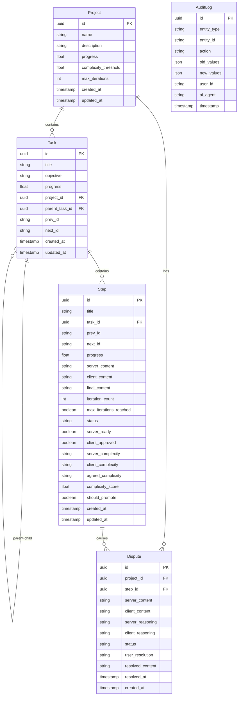

# Database Implementation

## Overview

This document covers the database implementation for the MCP-Planner system, including PostgreSQL setup, Prisma ORM integration, and data access patterns. The database implementation is broken down into multiple focused areas.

## Database Implementation Structure

The database implementation is organized into the following documents:

- **[Database Setup & Connection](./07b1-database-setup.md)** - PostgreSQL installation, connection management, and health checks
- **[Prisma Schema & Models](./07b2-prisma-schema.md)** - Complete Prisma schema definition and model generation
- **[Migrations & Versioning](./07b3-migrations.md)** - Database migration strategy and version management
- **[Data Access Layer](./07b4-data-access.md)** - Repository pattern and data access implementations
- **[Query Optimization](./07b5-query-optimization.md)** - Performance optimization and indexing strategies
- **[Database Testing](./07b6-database-testing.md)** - Testing strategies for database operations

## Database Architecture Overview

### Technology Stack
- **Database**: PostgreSQL 15+
- **ORM**: Prisma Go Client
- **Migration Tool**: golang-migrate
- **Connection Pooling**: pgxpool
- **Testing**: Testcontainers for integration tests

### Schema Design Principles

1. **Hierarchical Structure**: Projects → Tasks → Steps with unlimited nesting
2. **Polymorphic Navigation**: Steps and Tasks can reference each other via namespaced IDs
3. **Audit Trail**: Complete audit logging for all operations
4. **Collaboration State**: Track dual-AI collaboration workflow
5. **Performance**: Optimized indexes for navigation and queries

### Entity Relationships

## Core Database Operations

### Connection Management
- Connection pooling with configurable limits
- Health checks and automatic reconnection
- Graceful shutdown handling
- Connection metrics and monitoring

### Transaction Management
- ACID compliance for complex operations
- Optimistic locking for concurrent updates
- Rollback strategies for failed operations
- Transaction timeout handling

### Data Consistency
- Foreign key constraints
- Check constraints for data validation
- Triggers for audit logging
- Cascade delete policies

## Performance Considerations

### Indexing Strategy
- Primary keys (UUID) with B-tree indexes
- Navigation indexes for prev/next relationships
- Composite indexes for common query patterns
- Partial indexes for filtered queries

### Query Optimization
- Efficient hierarchical queries using CTEs
- Batch operations for bulk updates
- Query plan analysis and optimization
- Connection pooling optimization

### Caching Strategy
- Query result caching for read-heavy operations
- Cache invalidation on data updates
- Redis integration for distributed caching
- Application-level caching for frequently accessed data

## Data Migration Strategy

### Migration Principles
- Forward-only migrations for production
- Rollback strategies for development
- Data transformation scripts
- Zero-downtime deployment support

### Version Management
- Semantic versioning for schema changes
- Migration dependency tracking
- Environment-specific migrations
- Backup and restore procedures

## Security & Compliance

### Data Protection
- Encryption at rest for sensitive data
- Row-level security policies
- Audit logging for compliance
- Data retention policies

### Access Control
- Database user roles and permissions
- Application-level access control
- API key validation
- Rate limiting at database level

## Monitoring & Observability

### Database Metrics
- Connection pool utilization
- Query performance metrics
- Lock contention monitoring
- Storage utilization tracking

### Health Checks
- Database connectivity checks
- Query response time monitoring
- Replication lag monitoring
- Disk space alerts

## Backup & Recovery

### Backup Strategy
- Automated daily backups
- Point-in-time recovery capability
- Cross-region backup replication
- Backup verification procedures

### Disaster Recovery
- Recovery time objectives (RTO)
- Recovery point objectives (RPO)
- Failover procedures
- Data consistency verification

---

*Continue with detailed database implementation files:*
- *[Database Setup & Connection](./07b1-database-setup.md)*
- *[Prisma Schema & Models](./07b2-prisma-schema.md)*
- *[Migrations & Versioning](./07b3-migrations.md)*
- *[Data Access Layer](./07b4-data-access.md)*
- *[Query Optimization](./07b5-query-optimization.md)*
- *[Database Testing](./07b6-database-testing.md)*
