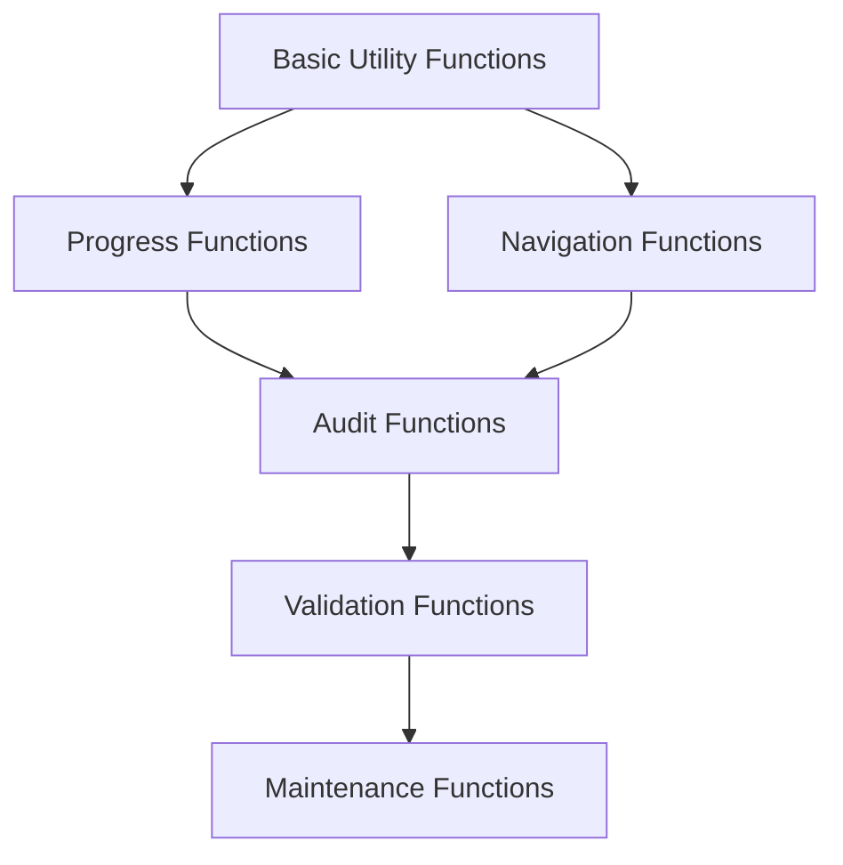

# Function & Trigger Migrations

## Overview

Database functions and triggers provide automated behavior, data consistency, and business logic enforcement for the MCP-Planner system. This guide is broken down into focused areas for systematic implementation.

## Function & Trigger Structure

The function and trigger implementation is organized into the following documents:

- **[Progress Calculation Functions](./07b3d1-progress-functions.md)** - Automatic progress calculation and updates
- **[Audit Logging Triggers](./07b3d2-audit-triggers.md)** - Comprehensive change tracking and audit trails
- **[Navigation Helper Functions](./07b3d3-navigation-functions.md)** - Polymorphic navigation and chain traversal
- **[Validation Functions](./07b3d4-validation-functions.md)** - Data validation and business rule enforcement
- **[Utility Functions](./07b3d5-utility-functions.md)** - Helper functions for common operations
- **[Maintenance Functions](./07b3d6-maintenance-functions.md)** - Database maintenance and cleanup operations

## Function Categories

### Progress Management
- Hierarchical progress calculation
- Automatic progress updates
- Progress validation and consistency
- Parent-child progress synchronization

### Audit & Tracking
- Comprehensive change logging
- User and AI agent activity tracking
- Data modification history
- System event recording

### Navigation & Workflow
- Polymorphic reference resolution
- Chain traversal algorithms
- Next item determination
- Workflow state management

### Data Validation
- Business rule enforcement
- Referential integrity checks
- Status transition validation
- Complex constraint checking

### System Utilities
- Data cleanup operations
- Performance optimization
- Maintenance tasks
- Reporting functions

## Implementation Strategy

### Migration Approach
1. **Core Functions First**: Progress and navigation functions
2. **Audit System**: Comprehensive change tracking
3. **Validation Layer**: Business rule enforcement
4. **Utility Functions**: Helper and maintenance functions
5. **Performance Optimization**: Trigger optimization and indexing

### Function Design Principles
- **Atomic Operations**: Each function performs a single, well-defined task
- **Error Handling**: Comprehensive error checking and meaningful messages
- **Performance**: Optimized for common use cases
- **Maintainability**: Clear code structure and documentation
- **Testability**: Functions designed for easy testing

### Trigger Strategy
- **Minimal Overhead**: Triggers only when necessary
- **Conditional Logic**: Smart triggers that avoid unnecessary work
- **Error Recovery**: Graceful handling of trigger failures
- **Audit Trail**: All trigger actions logged appropriately

## Function Naming Conventions

### Naming Patterns
```sql
-- Progress functions
calculate_project_progress(project_id UUID) RETURNS FLOAT
update_parent_progress() RETURNS TRIGGER
recalculate_hierarchy_progress(root_id UUID) RETURNS VOID

-- Navigation functions
get_next_actionable_item(project_id UUID) RETURNS TABLE(...)
resolve_polymorphic_reference(ref TEXT) RETURNS TABLE(...)
traverse_navigation_chain(start_ref TEXT) RETURNS TABLE(...)

-- Validation functions
validate_step_status_transition(old_status TEXT, new_status TEXT) RETURNS BOOLEAN
check_circular_reference(task_id UUID, parent_id UUID) RETURNS BOOLEAN
enforce_business_rules() RETURNS TRIGGER

-- Utility functions
cleanup_orphaned_records() RETURNS INTEGER
optimize_navigation_indexes() RETURNS VOID
generate_project_statistics(project_id UUID) RETURNS JSON
```

### Parameter Conventions
- **Entity IDs**: Always UUID type
- **Status Values**: Use enum types when available
- **Return Types**: Specific types for single values, TABLE for multiple rows
- **Optional Parameters**: Use DEFAULT values or function overloading

## Trigger Implementation

### Trigger Types
```sql
-- BEFORE triggers for validation
CREATE TRIGGER validate_before_insert
    BEFORE INSERT ON table_name
    FOR EACH ROW
    EXECUTE FUNCTION validation_function();

-- AFTER triggers for cascading updates
CREATE TRIGGER update_after_change
    AFTER INSERT OR UPDATE OR DELETE ON table_name
    FOR EACH ROW
    EXECUTE FUNCTION update_function();

-- INSTEAD OF triggers for views
CREATE TRIGGER handle_view_update
    INSTEAD OF UPDATE ON view_name
    FOR EACH ROW
    EXECUTE FUNCTION view_update_function();
```

### Trigger Timing
- **BEFORE**: Validation, data transformation, constraint checking
- **AFTER**: Audit logging, cascading updates, notifications
- **INSTEAD OF**: View updates, complex data modifications

## Performance Considerations

### Function Optimization
- **Query Planning**: Use EXPLAIN to optimize function queries
- **Index Usage**: Ensure functions use appropriate indexes
- **Caching**: Cache frequently accessed data within functions
- **Batch Operations**: Process multiple items efficiently

### Trigger Optimization
- **Conditional Execution**: Only execute when necessary
- **Minimal Work**: Keep trigger logic lightweight
- **Async Processing**: Use queues for heavy operations
- **Error Handling**: Prevent trigger failures from blocking operations

## Testing Strategy

### Function Testing
```sql
-- Unit tests for individual functions
SELECT test_calculate_project_progress();
SELECT test_navigation_chain_traversal();
SELECT test_status_transition_validation();

-- Integration tests for trigger workflows
SELECT test_progress_update_cascade();
SELECT test_audit_logging_completeness();
SELECT test_validation_enforcement();
```

### Test Data Management
- **Isolated Test Data**: Separate test schemas or databases
- **Reproducible Tests**: Consistent test data setup
- **Edge Case Testing**: Test boundary conditions and error cases
- **Performance Testing**: Validate function performance under load

## Monitoring & Maintenance

### Function Monitoring
- **Execution Time**: Track function performance
- **Error Rates**: Monitor function failures
- **Usage Patterns**: Identify frequently used functions
- **Resource Usage**: Monitor memory and CPU consumption

### Trigger Monitoring
- **Trigger Frequency**: Track trigger execution rates
- **Cascade Effects**: Monitor cascading trigger chains
- **Error Handling**: Track trigger failures and recovery
- **Performance Impact**: Measure trigger overhead

## Migration Dependencies

### Function Dependencies


### Migration Order
1. **Utility Functions**: Basic helper functions
2. **Progress Functions**: Core progress calculation
3. **Navigation Functions**: Polymorphic navigation
4. **Audit Functions**: Change tracking
5. **Validation Functions**: Business rules
6. **Maintenance Functions**: Cleanup and optimization

---

*Continue with detailed function and trigger implementation files:*
- *[Progress Calculation Functions](./07b3d1-progress-functions.md)*
- *[Audit Logging Triggers](./07b3d2-audit-triggers.md)*
- *[Navigation Helper Functions](./07b3d3-navigation-functions.md)*
- *[Validation Functions](./07b3d4-validation-functions.md)*
- *[Utility Functions](./07b3d5-utility-functions.md)*
- *[Maintenance Functions](./07b3d6-maintenance-functions.md)*
